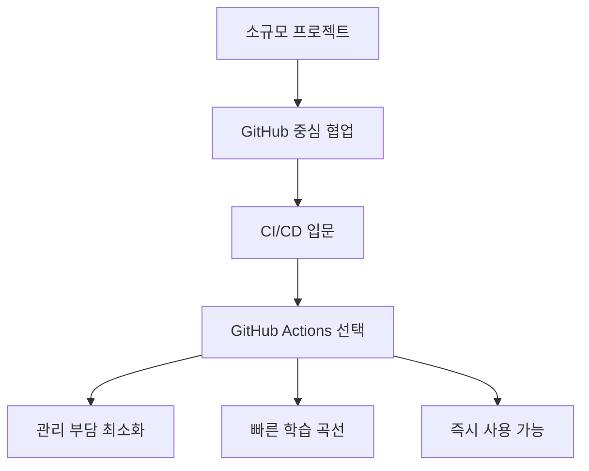
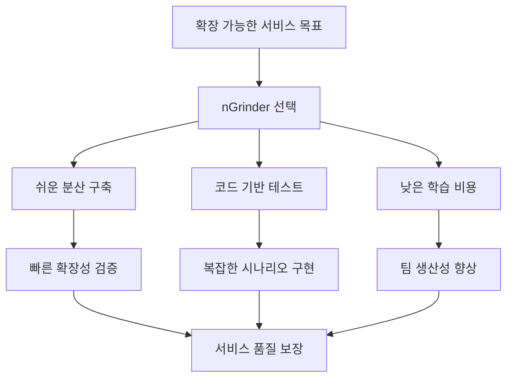

## 📚 목차

<aside>

</aside>

## 🎦  프로젝트 소개

> 영화 예매 시스템 - FilmPass
> 

### **저희 Film Pass는 고객들에게 빠르고 안정적인 영화 티켓 예매 경험을 제공하고**

### **고객들이 원하는 영화를 즐길 수 있도록 도와주는 영화 관람 티켓팅 전문 어플리케이션 입니다.**

## 📖 설계 문서

<aside>
💡

### **🐬API 명세서**

[제목 없음](https://www.notion.so/2662dc3ef51481df8c73efd11176dbae?pvs=21)

</aside>

<aside>
💡

### **🎀ERD**

- V1
    
    
    
- V2
    
    
    
</aside>

<aside>
💡

### **🌍와이어 프레임**


</aside>

<aside>
💡

### 🎦아키텍처


</aside>

## 🛠️ 기술 스택

언어 및 프레임 워크

[Java 17](https://www.notion.so/Java-17-2662dc3ef51481279550c99e41478e62?pvs=21)

[Spring Boot](https://www.notion.so/Spring-Boot-2662dc3ef5148142b851f9fcd88bb556?pvs=21)

[Spring Data JPA](https://www.notion.so/Spring-Data-JPA-2662dc3ef514818eafd9fc20b257e673?pvs=21)

인증 인가

[Spring Security](https://www.notion.so/Spring-Security-2662dc3ef514815ba63fde8118c276b5?pvs=21)

[JWT](https://www.notion.so/JWT-2662dc3ef514810aa159eef0de6f09e8?pvs=21)

JWT 로그

[slf4j ](https://www.notion.so/slf4j-2662dc3ef514813fbb0bc4878dfca50a?pvs=21)

**Database**

[MySQL](https://www.notion.so/MySQL-2662dc3ef51481daa4adc5a7df2913b4?pvs=21)

[Redis](https://www.notion.so/Redis-2662dc3ef51481818152e4d18df5d43c?pvs=21)

**Infra & CI/CD**

[Docker](https://www.notion.so/Docker-2662dc3ef5148199bb51c3ddca8c07a1?pvs=21)

[Amazon EC2](https://www.notion.so/Amazon-EC2-2662dc3ef51481e39494db03103953ef?pvs=21)

[Amazon RES ](https://www.notion.so/Amazon-RES-2662dc3ef51481a39af9e0edf7c3a772?pvs=21)

[GItHub Actions](https://www.notion.so/GItHub-Actions-2662dc3ef5148197a825f1378910d988?pvs=21)

[Nginx](https://www.notion.so/Nginx-2662dc3ef51481c78a38e9b7be56d872?pvs=21)

[Elasticsearch](https://www.notion.so/Elasticsearch-2662dc3ef5148165865ff0e7f35f4970?pvs=21)

[Kibana](https://www.notion.so/Kibana-2662dc3ef5148188b0e3c7f647fb50fe?pvs=21)

**Test**

[Postman](https://www.notion.so/Postman-2662dc3ef51481df9b20fad5057178ff?pvs=21)

[Junit5](https://www.notion.so/Junit5-2662dc3ef514816ab320fd48c0554421?pvs=21)

[K6](https://www.notion.so/K6-2662dc3ef5148132bbeefe2db0dc361f?pvs=21)

[nGrinder](https://www.notion.so/nGrinder-2662dc3ef51481579440d1bf5d67c767?pvs=21)

[Swagger](https://www.notion.so/Swagger-2662dc3ef5148157bc37ecbe46176c1e?pvs=21)

**Tools**

[Intellij IDEA](https://www.notion.so/Intellij-IDEA-2662dc3ef5148117851ecafa404a738c?pvs=21)

**Collaboration**

[Notion](https://www.notion.so/Notion-2662dc3ef51481a3988dd876d84ae83e?pvs=21)

[GitHub](https://www.notion.so/GitHub-2662dc3ef51481b39954e6c9672a9154?pvs=21)

[Slack](https://www.notion.so/Slack-2662dc3ef5148160a8f6d1ea74e1ae17?pvs=21)

[ERD cloud](https://www.notion.so/ERD-cloud-2662dc3ef5148195b98ffaf94ffa8e0d?pvs=21)

[RESTful API](https://www.notion.so/RESTful-API-2662dc3ef51481f780cdd9c5c21a29ba?pvs=21)

[draw.io](https://www.notion.so/draw-io-2662dc3ef514819698e8e1700bb146ae?pvs=21)

## 💡 기술적 의사 결정

<aside>
🔒

### Redis Lock

# 기술 스택 비교 분석

## 주요 기술별 특징 비교

| 기술 분류 | Redis | ZooKeeper | etcd |
| --- | --- | --- | --- |
| **데이터 처리** | 개발자 친화적 | 모니터링 지원 | 설정 정보 지원 |
| **메모리** | In-Memory | 실시간으로 노출 | 클러스터 구성 |
| **특징** | SET NX EX TTL 기능 | Z-node Watcher | gRPC, Watch API |
| **운영 방식** | 성능위주로 위험 | 무결성 유지향 | 정합성 확보 |
| **네트워크** | 기본 방식 응답 | 노드 방식과 넘김 | 노드 방식과 넘김 |

---

## 검토 및 추천 사항

### 완료된 검토 항목

- **Redis 선택 이유**: 데이터 접근과 기간관 구조 처리 개선 인프라 통합 기능

### 검토 중인 항목

- **ZooKeeper**: 검토된 방법과 미 개조자치 시스템 목표 다른 정보 스택

### 최종 권장 사항

- **최종 판단**: 분산된 클러스터들은 Redis의 SET NX EXI TTL 기능이 충분하여 비롯 투자

---

## 주요 특징 요약

### Redis 장점

- **개발 친화성**: 개발자가 사용하기 쉬운 구조
- **고성능**: In-Memory 방식으로 빠른 처리

### ZooKeeper 장점

- **모니터링**: 실시간 시스템 상태 파악 가능
- **안정성**: 무결성 중심의 운영 방식
- **분산 코디네이션**

### etcd 장점

- **클러스터링**: 안정적인 클러스터 구성
- **정합성**: 데이터 일관성 보장

---

## 결론

**Redis가 최종 선택**된 이유:

- 개발팀의 친숙함과 높은 성능
- 낮은 학습 곡선

> 참고: 각 기술은 고유한 장점이 있으나, 프로젝트 요구사항과 팀 역량을 고려할 때 Redis가 가장 적합한 선택으로 판단됨
> 

---

</aside>

<aside>
📌

### Github action

# 🔧 CI/CD 도구 선택: GitHub Actions vs Jenkins

## 📋 프로젝트 특성 분석

### 🎯 현재 프로젝트 환경

- **협업 방식**: GitHub 중심적인 협업 체계
- **규모**: 소규모 프로젝트
- **CI/CD 경험**: 입문 단계

---

## ✅ GitHub Actions 선택 시 장점

### 🚀 **관리 편의성**

> GitHub이 직접 관리해주어 별도의 설치/유지보수 부담 없음
> 

### ⚡ **설정의 간편함**

> 간단한 YAML 설정만으로 CI/CD 파이프라인 구현 가능
> 

### 🔗 **완벽한 GitHub 통합**

> PR, push, branch 등의 GitHub 이벤트와 즉시 연동 가능
> 

---

## ❌ Jenkins를 제외한 이유

| 구분 | Jenkins 단점 | 프로젝트 영향 |
| --- | --- | --- |
| **인프라 관리** | 별도 서버 설치 필요 | 📈 운영 부담 상승 |
| **유지보수** | 플러그인/업데이트/보안 패치 직접 관리 | ⚠️ 지속적인 관리 리소스 필요 |
| **설정 복잡성** | SSH 플러그인, 스크립트 직접 구성 | 🔧 높은 진입 장벽 |

### 🛡️ Jenkins의 장점 (고려사항)

> 내부망 전용 구축 가능 → 보안이 매우 민감한 프로젝트에 적합
> 

---

## 🎯 최종 결론

### ✨ **GitHub Actions가 적합한 이유**



### 📊 **선택 근거 요약**

1. **Zero Management**: 서버 관리, 패치, 업데이트 불필요
2. **Native Integration**: GitHub 이벤트와 완벽 연동
3. **Low Barrier**: YAML 기반의 직관적 설정
4. **Perfect Fit**: 프로젝트 규모와 팀 역량에 최적화

---

## 💡 권장사항

### 🟢 **현재 상황에서 GitHub Actions 사용**

- 프로젝트 초기 단계에서 빠른 CI/CD 구축
- GitHub 생태계 내에서 완결적 개발 환경 구성

### 🟡 **향후 고려사항**

- 프로젝트 규모 확장 시 Jenkins 재검토 가능

---

</aside>

<aside>
🪙

### Redis cache

# 🗄️ 캐시 기술 선택: Redis 도입 근거 분석

## ❌ 다른 캐시 기술들의 주요 단점

### 📊 기술별 제약사항 비교

| 기술 | 핵심 단점 | 프로젝트 영향도 |
| --- | --- | --- |
| **Memcached** | 🚫 서버간 공유 캐시 불가능 | 🔴 **높음** - 분산 환경 구축 불가 |
| **Hazelcast** | ⚙️ 운영 난이도 복잡 | 🟡 **중간** - 높은 관리 리소스 요구 |
| **ZooKeeper** | 📝 eviction 정책 없음 | 🟡 **중간** - 메모리 관리 어려움 |
| **etcd** | 📝 eviction 정책 없음 | 🟡 **중간** - 메모리 관리 어려움 |
| **Consul** | 🐌 캐시 처리속도 느림 | 🟠 **중상** - 성능 병목 발생 |

---

## ✅ Redis 선택을 통한 문제 해결

### 🎯 **핵심 문제 해결**

### 1. 🔄 **분산 캐시 지원**

> 다중 서버가 공유 캐시를 사용 가능
> 
- Memcached의 서버 간 공유 제약 완벽 해결
- 확장성 있는 분산 아키텍처 구현

### 2. ⚙️ **풍부한 운영 옵션**

> eviction 정책을 포함한 다양한 운영 옵션 존재
> 
- ZooKeeper/etcd 대비 메모리 관리 자동화
- LRU, LFU 등 다양한 정책 선택 가능

### 3. ⚡ **성능 최적화**

> 빠른 속도 및 TTL로 인한 키 관리 용이
> 
- Consul 대비 현저히 빠른 처리 속도
- 자동 만료를 통한 효율적 메모리 관리
- Hazelcast 대비 단순한 운영 구조

---

## 🌟 Redis의 추가 장점

### 📚 **Best Practice & 커뮤니티**

> 시행착오에 대한 많은 정보가 존재
> 

### 풍부한 레퍼런스

- 대규모 서비스 운영 사례 다수
- 문제 해결을 위한 검증된 솔루션 존재
- 활발한 커뮤니티와 문서화

### 학습 곡선 최소화

- 검증된 설정 가이드 제공
- 일반적인 이슈에 대한 해결책 공유
- 성능 튜닝 방법론 확립

---

## 🎯 결론: Redis 선택의 타당성

### 📈 **기술적 우선순위 매칭**

```
프로젝트 요구사항 ✅ Redis 해결책
────────────────────────────────────
분산 캐시 필요      → 서버간 공유 캐시 지원
메모리 효율성       → Eviction 정책 제공
고성능 처리         → 빠른 처리 속도
운영 안정성         → 단순한 관리 구조
위험도 최소화       → Best Practice 풍부

```

### 💡 **종합 평가**

| 평가 항목 | 점수 | 근거 |
| --- | --- | --- |
| **기능성** | ⭐⭐⭐⭐⭐ | 분산 캐시 + eviction 정책 완벽 지원 |
| **성능** | ⭐⭐⭐⭐⭐ | 높은 처리 속도 + TTL 자동 관리 |
| **운영성** | ⭐⭐⭐⭐⭐ | 단순한 구조 + 풍부한 레퍼런스 |
| **안정성** | ⭐⭐⭐⭐⭐ | 검증된 Best Practice 존재 |

---

## 🚀 최종 권장사항

### ✨ **Redis 도입 결정**

- **모든 주요 요구사항 충족**: 다중 서버 지원, 성능, 운영 편의성
- **위험도 최소화**: 충분한 레퍼런스와 커뮤니티 지원
- **확장성 보장**: 프로젝트 성장에 따른 유연한 대응 가능

> 💭 한줄 요약: Redis는 다른 캐시 기술들의 핵심 단점을 모두 해결하면서도, 풍부한 Best Practice로 안정적이고 효율적인 캐시 솔루션 제공
> 

---

</aside>

<aside>
🔍

### Elasticsearch

# 🔍 ElasticSearch

---

### Elastic search란?

JSON 형식의 데이터를 저장하며 루씬 기반으로 개발되어있어 빠른 검색이 가능합니다

서비스의 검색을 위해 사용되거나, 로그 등의 데이터를 검색할때 자주 사용됩니다

**Lucene(루씬)?**

자바로 만들어진 고성능 정보 검색 라이브러리입니다

검색 기능을 갖고 있는 애플리케이션을 개발할 때 사용할 수 있는 라이브러리입니다

### 특징

- **분산 시스템**: 데이터를 여러 노드에 분산하여 저장하므로 시스템이 확장될 때 데이터의 양이 증가해도 처리속도가 유지됩니다
- **전문 검색(Full-Text)**: Lucene의 강력한 검색 기능을 활용하여 전문 검색을 지원합니다 사용자가 특정 단어나 문구를 검색하면 관련도가 높은 문서를 빠르게 찾아낼 수 있습니다
- **데이터 처리 기능**: 데이터의 생성, 검색, 분석 등의 다양한 기능을 제공합니다
- **실시간 검색**: 저장된 데이터에 대해 실시간으로 검색과 분석을 수행할 수 있습니다
- **RESTful API**: 다양한 프로그램 언어로 작성된 애플리케이션에서 쉽게 접근 가능합니다

### 그럼 elasticsearch 왜 사용하는가? 사용하면 무슨 장점이 있는가?

1.    **빠른 검색 기능**: Lucene기반으로 구축되어 있어 대량의 데이터에 대한 빠른 검색과 실시간        분석을 가능하게 합니다

2.   **확장성**: 수평적으로 확장 가능한 분산 시스템으로 설계되었습니다.이는 데이터 양이 증가           함에 따라 더 많은 서버를 추가하여시스템을 확 장할 수 있음을 의미합니다

1. **다양한 데이터 처리 기능**: 단순한 검색뿐만 아니라 복잡한 데이터 집계, 분석기능을 제공합니다 이를 통해사용자는 로그 데이터  분석 실시간 모니터링, 비즈니스 인텔리전스 등 다양한 분석 작업을 수행할 수 있습니다
2. **가용성, 신뢰성**: 데이터는 자동으로 여러노드에 복죄되므로, 어떤 서버에 장애가 발생해도 데이터 손실없이서비스를 지속할 수 있습니다

5.   **개발자 친화적**: elasticsearch는 RESTful API를 제공하여 다양한 프로그래밍 언어로 쉽게           접근하고사용할 수 있습니다 이는 개발자가 복잡한 설정 없이도 elasticsearch를 빠르게            통  합하고 활용할 수 있음을 의미합니다


---

</aside>

<aside>
💡

### nGrinder

# ⚡ 성능 테스트 도구 선택: nGrinder 도입 근거

## 🎯 프로젝트 목적과의 일치성

### 🚀 **핵심 목표**

> 확장 가능한 서비스 개발이라는 프로젝트 목적과 부합 및 손쉬운 도입 가능
> 

---

## ✅ nGrinder 선택의 핵심 장점

### 📊 **주요 강점 분석**

### 1. 🔄 **확장성**

> 분산/부하를 쉽게 늘릴 수 있음
> 
- Agent 추가만으로 부하 규모 확장 가능
- 웹 UI를 통한 직관적 분산 환경 관리
- Controller-Agent 구조로 안정적 부하 분산

### 2. 💻 **코드 친화적 접근**

> API 호출 흐름을 코드처럼 표현 가능
> 
- Groovy/Jython 스크립트 기반
- 복잡한 시나리오도 프로그래밍적으로 구현
- 개발자에게 익숙한 코드 기반 테스트 설계

### 3. 🇰🇷 **국내 생태계 우위**

> 국내 문서와 사례가 많고, 도입/학습 장벽이 낮음
> 
- 네이버 오픈소스로 한국어 문서 풍부
- 국내 대형 서비스 적용 사례 다수
- 커뮤니티 활성화로 빠른 문제 해결 가능

---

## ❌ 다른 도구들의 제외 사유

### 📋 **경쟁 기술 비교 분석**

| 도구 | 핵심 단점 | 프로젝트 영향 |
| --- | --- | --- |
| **JMeter** | 🔧 분산 부하 환경 구축 번거로움<br/>⚙️ 관리 복잡성 | 🔴 **높음** - 운영 리소스 과다 소요 |
| **Gatling** | 📚 국내 활용사례 부족 | 🟡 **중간** - 학습비용 증가, 트러블슈팅 어려움 |

### 🔍 **세부 제외 근거**

### **JMeter의 한계**

- 분산 테스트 설정의 복잡성
- Agent 관리와 동기화 이슈
- GUI 기반 설정의 버전 관리 어려움

### **Gatling의 아쉬운 점**

- Scala 기반으로 국내 개발자 친숙도 낮음
- 레퍼런스와 커뮤니티 지원 부족
- 문제 발생 시 해결책 찾기 어려움

---

## 🌟 nGrinder 선택의 전략적 가치

### 💡 **비즈니스 관점에서의 이점**



### 🎯 **핵심 성공 요소**

| 요소 | nGrinder 우위 | 프로젝트 기여도 |
| --- | --- | --- |
| **확장성** | 손쉬운 분산 환경 구축 | ⭐⭐⭐⭐⭐ |
| **개발 효율성** | 코드 기반 테스트 작성 | ⭐⭐⭐⭐⭐ |
| **러닝커브** | 풍부한 한국어 자료 | ⭐⭐⭐⭐⭐ |
| **유지보수성** | 직관적 웹 UI 관리 | ⭐⭐⭐⭐ |

---

## 🚀 최종 결론

### ✨ **nGrinder 도입 결정의 타당성**

### **전략적 부합성**

- 프로젝트 목표(확장 가능한 서비스)와 완벽 매칭
- 분산 부하 테스트를 통한 확장성 사전 검증

### **운영 효율성**

- JMeter 대비 **관리 복잡도 대폭 감소**
- Gatling 대비 **학습 비용 최소화**

### **리스크 최소화**

- 국내 검증된 도구로 **안정적 도입 가능**
- 풍부한 레퍼런스로 **빠른 문제 해결**

---

## 📋 실행 계획

### 🎯 **단계별 도입 로드맵**

1. **1단계**: nGrinder 환경 구축 (Controller + Agent)
2. **2단계**: 기본 시나리오 작성 및 테스트
3. **3단계**: 분산 부하 환경 확장 검토

> 💭 한줄 요약: 확장 가능한 서비스 개발 목표 달성을 위해 nGrinder는 쉬운 분산 구축 + 코드 친화적 접근 + 낮은 학습 장벽을 제공하는 최적의 선택
> 

---

</aside>

## ⚙ 트러블 슈팅

<aside>

### nGrinder 사용 중 agent의 CPU 병목현상

### 

# 🔥 nGrinder Agent CPU 병목현상 해결 사례

> 📌 중요도: 🔴 높음 | 해결 완료: ✅ | 소요 시간: 반나절
> 

---

## 1️⃣ 문제 인식

### 🚨 **발생한 문제**

nGrinder를 사용하여 성능 테스트를 진행하던 중, **트래픽 발생기인 agent의 CPU가 99% ~ 100%로 사용**되는 심각한 병목현상 발생

### 📊 **문제의 영향도**

| 영향 영역 | 문제점 | 심각도 |
| --- | --- | --- |
| **테스트 정확성** | 실제 결과가 왜곡되어 나타날 수 있음 | 🔴 **심각** |
| **성능 측정** | 실제 보내는 요청 수가 의도한 요청보다 적음 | 🔴 **심각** |
| **리소스 효율성** | Agent 서버 과부하로 추가 비용 발생 | 🟡 **보통** |

---

## 2️⃣ 원인 분석

### 🔍 **근본 원인 파악**

### **스크립트 비효율성**

- **무거운 실행 스크립트**: 불필요한 처리로 CPU 과부하 유발

### **세부 원인 분석**

| 원인 | 구체적 문제점 |
| --- | --- |
| **불필요한 쿠키 처리** | 쿠키가 없는데 쿠키를 추가하는 코드 존재 |
| **과도한 로깅** | 불필요하게 로그를 남기는 코드가 다수 존재 |
| **무제한 요청** | 요청에 지연이 없어 연속적인 처리 부하 |

---

## 3️⃣ 해결 방법

### ⚡ **스크립트 최적화 전략**

### **1. 실행 스크립트 경량화**

### 📝 **로그 코드 최소화**

- **AS-IS (현재 상태)**: 다수의 로그 코드가 성능 저하 유발
- **TO-BE (개선 목표 상태)**: 필수 로그 1개만 유지하고 나머지 주석 처리

```java
// 🔧 최적화된 로깅
// grinder.logger.info("before. init headers and cookies")
// grinder.logger.info("before thread.")

```

### 🍪 **불필요한 쿠키 처리 제거**

- **AS-IS**: 존재하지 않는 쿠키를 처리하는 오버헤드
- **TO-BE**: 쿠키 관련 코드 완전 주석 처리

```java
// 🔧 쿠키 처리 비활성화
// CookieManager.addCookies(cookies)

```

### **2. 요청 패턴 최적화**

### ⏱️ **적절한 지연 시간 추가**

- **목적**: CPU 과부하 방지 및 현실적인 사용자 패턴 모사
- **구현**: 요청 간 5초 지연 추가

```java
// 🔧 요청 간격 조절
grinder.sleep(5)

```

---

## 4️⃣ 결과 & 검증

### 📈 **개선 효과 측정**

### **CPU 사용량 비교**

| 상태 | CPU 사용률 | 안정성 | 테스트 정확도 |
| --- | --- | --- | --- |
| **최적화 전** | 99% ~ 100% | ❌ 불안정 | ❌ 결과 왜곡 |
| **최적화 후** | 정상 범위 | ✅ 안정적 | ✅ 정확한 측정 |

### 개선 전/후 CPU 사용량

- **과부하된 Agent** 📸
    
    
    

- **정상적으로 돌아온 Agent** 📸
    
    
    

---

## 💡 교훈 & 베스트 프랙티스

### 🎯 **핵심 교훈**

1. **스크립트 효율성이 성능 테스트의 정확성을 좌우**
2. **불필요한 로깅과 처리는 Agent 리소스 낭비의 주원인**
3. **현실적인 사용자 패턴 반영으로 더 정확한 테스트 가능**

### 📋 **향후 적용 가이드라인**

### **✅ DO**

- 스크립트 작성 시 필수 기능만 포함
- 요청 간 적절한 지연 시간 설정
- 정기적인 Agent 리소스 모니터링

### **❌ DON'T**

- 과도한 로깅 코드 작성 금지
- 불필요한 쿠키/헤더 처리 지양
- 무제한 연속 요청 패턴 사용 지양

---

> 💭 한줄 요약: nGrinder Agent의 CPU 병목현상은 스크립트 경량화 + 적절한 지연시간으로 완벽 해결 가능하며, 이를 통해 정확하고 안정적인 성능 테스트 환경 구축 완료
> 

---

</aside>

<aside>

### 다중 검색 기능이 동작하지 않는 현상

# 🔍 다중 검색 기능 오류 해결 사례

> 📌 중요도: 🟠 중간 | 해결 완료: ✅ | 소요 시간: 2시간
> 

---

## 1️⃣ 문제 인식

### 🚨 **발생한 문제**

**다중 키워드로 영화 검색이 되지 않는 문제**가 발생하여 사용자 검색 기능이 제대로 작동하지 않음

### 📊 **문제 영향 범위**

| 영향 영역 | 구체적 문제 | 사용자 경험 |
| --- | --- | --- |
| **검색 기능** | 단일 조건으로만 검색 가능 | 😞 **불편함** |
| **사용성** | 복합 조건 검색 불가 | 😤 **답답함** |
| **서비스 완성도** | 기대 기능 미작동 | 😔 **실망감** |

---

## 2️⃣ 원인 분석

### 🔍 **근본 원인 파악**

### **기술적 접근 방식의 한계**

- **AS-IS**: 쿼리메서드로 다중 키워드를 포함하도록 구현
- **문제점**: 쿼리메서드가 **제대로 동작하지 않음**

### 💭 **왜 쿼리메서드가 실패했을까?**

| 쿼리메서드 특성 | 다중 검색 요구사항 | 부합성 |
| --- | --- | --- |
| **정적 쿼리 구조** | 동적 조건 조합 필요 | ❌ **불일치** |
| **메서드명 기반** | 복잡한 조건문 처리 | ❌ **한계** |
| **NULL 처리 어려움** | 선택적 파라미터 핸들링 | ❌ **부족** |

---

## 3️⃣ 해결 방법

### ⚡ **해결 전략: 동적 쿼리 도입**

### **기술 선택: JPQL → Native Query**

> 동적 쿼리에 보다 적합한 JPQL을 활용하여 다중키워드 검색 구현
> 

### 🛠️ **구현 세부사항**

### **핵심 해결 포인트**

1. **조건부 검색**: `IS NULL OR` 패턴으로 선택적 파라미터 처리
2. **페이징 지원**: `Page<Movie>` 반환으로 대용량 데이터 대응
3. **카운트 쿼리 분리**: 성능 최적화를 위한 별도 카운트 쿼리

### **최종 구현 코드**

```java
@Query(
    value = "SELECT * FROM movies " +
            "WHERE (:id IS NULL OR id = :id) " +
            "AND (:title IS NULL OR title = :title) " +
            "AND (:director IS NULL OR director = :director)"+
            "AND (:genre IS NULL OR genre = :genre)",

    countQuery = "SELECT COUNT(*) FROM movies " +
            "WHERE (:id IS NULL OR id = :id) " +
            "AND (:title IS NULL OR title = :title) " +
            "AND (:director IS NULL OR director = :director)" +
            "AND (:genre IS NULL OR genre = :genre)",

    nativeQuery = true
)
Page<Movie> searchMoviesNative(
        @Param("id") Long id,
        @Param("title") String title,
        @Param("director") String director,
        @Param("genre") String genre,
        Pageable pageable
);

```

### 🔧 **코드 분석**

### **쿼리 구조 해부**

| 구성 요소 | 역할 | 장점 |
| --- | --- | --- |
| **조건부 WHERE절** | `(:param IS NULL OR column = :param)` | 🎯 **선택적 검색** |
| **AND 연산자** | 다중 조건 결합 | 🔗 **복합 검색** |
| **페이징 파라미터** | `Pageable pageable` | 📄 **성능 최적화** |
| **카운트 쿼리** | 별도 COUNT 쿼리 | ⚡ **속도 개선** |

---

## 4️⃣ 결과 & 검증

### 📈 **개선 효과**

### **기능 동작 확인**

| 검색 시나리오 | AS-IS | TO-BE |
| --- | --- | --- |
| **단일 조건** (제목만) | ❌ 동작 안함 | ✅ **정상 동작** |
| **다중 조건** (제목+감독) | ❌ 동작 안함 | ✅ **정상 동작** |
| **부분 조건** (장르만) | ❌ 동작 안함 | ✅ **정상 동작** |
| **전체 조건** (모든 필드) | ❌ 동작 안함 | ✅ **정상 동작** |

### **성능 및 사용성**

- **✅ 페이징 처리**: 대용량 결과에도 빠른 응답
- **✅ NULL 안전**: 빈 파라미터 처리 완벽
- **✅ 유연한 검색**: 원하는 조건만 입력 가능

---

## 💡 교훈 & 베스트 프랙티스

### 🎯 **핵심 교훈**

### **1. 기술 선택의 중요성**

> 쿼리메서드 vs 동적쿼리: 요구사항에 따른 적절한 선택 필요
> 

### **2. 동적 쿼리 패턴 학습**

> IS NULL OR 패턴으로 선택적 파라미터 처리의 표준 방법 습득
> 

### 📋 **적용 가이드라인**

### **✅ 동적 쿼리 사용 시기**

- 검색 조건이 선택적일 때
- 복잡한 조건 조합이 필요할 때
- 쿼리메서드로 표현이 어려울 때

### **✅ 구현 시 고려사항**

- **NULL 처리**: `IS NULL OR` 패턴 활용
- **성능**: 별도 카운트 쿼리 작성
- **가독성**: 쿼리 포맷팅으로 유지보수성 확보

---

## 🔄 기술 비교 요약

### **쿼리메서드 vs 동적쿼리**

| 구분 | 쿼리메서드 | 동적쿼리 (JPQL) |
| --- | --- | --- |
| **사용성** | 🟢 **간단** | 🟡 **보통** |
| **유연성** | 🔴 **제한적** | 🟢 **높음** |
| **복잡한 조건** | 🔴 **어려움** | 🟢 **적합** |
| **NULL 처리** | 🔴 **복잡** | 🟢 **쉬움** |
| **유지보수** | 🟢 **쉬움** | 🟡 **보통** |

---

## 🚀 다음 단계

### 📌 **추가 개선 계획**

1. **검색 성능 최적화**: 인덱스 추가 검토
2. **검색어 유사도**: LIKE 검색 패턴 적용 고려
3. **캐싱 전략**: 자주 사용되는 검색 결과 캐싱

> 💭 한줄 요약: 쿼리메서드의 한계를 동적 JPQL 쿼리로 해결하여 유연하고 안정적인 다중 검색 기능 완성
> 

---

</aside>

<aside>

### 트랜잭션 커밋 전 락이 해제되어 중복 예약이 발생하는 문생

## 문제 정의

---

락을 적용 했음에도 적용 되지 않은 것처럼 동시성 이슈가 발생

---

## **원인**

하나의 트랙잭션에서 비지니스 로직과 락 해제가 수행 

- **락 해제 타이밍** : 트랜잭션이 커밋되기 전에 락이 해제되는 문제
- **동시성 제어 실패**: 락이 해제된 뒤 트랜잭션 커밋 사이 간극에서 동시성 이슈 발생

### 플로우 분석

1. 요청 A 가 들어온 후 락 획득
2. 요청 A 검증 후 로직 수행 
3. 로직 수행 후 락 해제
4. 요청 B 들어옴
5. 요청 B 검증 
6. 요청 A 트랜잭션 커밋
7. 요청 B 로직 수행
8. 동시성 이슈 발생

---

## 3. 해결 방법

트랜잭션 범위를 락 해제 이전으로 고정

### **1. 로직 분리**

- 검증 로직: 데이터 검증 로직은 트랜잭션 안에 존재할 필요성이 없음. 그러나 좌석 예약이 되어                     있는지 검증하는 로직은 반드시 트랜잭션 안에 존재해야 함.
- 임계구역 최소화를 위해 비동시성 검증 로직에는 락을 걸지 않는 다.
- 저장 로직: 데이터 정합성을 위해 반드시 트랜잭션 안에 존재해야 함.

### **개선된 플로우 분석**

1. 요청 A 가 들어온 후 데이터 검증
2. 요청 A  락 획득
3. 예약 여부 확인 후 로직 수행
4. 결과값 저장 후 트랜잭션 커밋
5. 요청 B 들어온 후 데이터 검증
6. 요청 B 락 획득 실패  후 재시도 
7. 요청 A 락 해제
8. 요청 B 획득
9. 요청 B 로직 수행

---

</aside>

<aside>

### Cache 가 Redis 에 등록되지 않는 현상

# 🔧 Cache가 Redis에 등록되지 않는 현상

---

## 🚨 1. 문제 인식

코드 상에서 캐시를 적용완료 했고 요청도 정상적으로 응답은 반환하는데 **캐시가 Redis에 저장되지 않는 문제** 발생

---

## 🔍 2. 원인 분석

### 주요 원인

- Redis가 **docker 및 로컬 모두에서 실행**되고 있었음

### 문제 상황

- 🔎 **캐시가 어디있는지 확인한 곳**: Docker의 Redis
- 💾 **실제 저장된 곳**: 로컬의 Redis
- ❌ **결과**: Docker에서 확인이 안되었던 것

> 💡 핵심 이슈: 애플리케이션은 로컬 Redis에 연결되어 캐시를 저장하고 있었지만, 개발자는 Docker Redis에서 확인하려 했던 상황
> 

---

## ✅ 3. 해결 방법

실행중인 **로컬의 Redis를 종료**하고 **Docker의 Redis**로 캐시가 저장되게끔 변경

### 실행 단계

1. 로컬 Redis 프로세스 종료
2. 애플리케이션이 Docker Redis에 연결되도록 설정 확인
3. 캐시 동작 재테스트

---

## 🎉 4. 결과

✅ **정상적으로 Docker의 Redis에 값이 저장되어 있음을 확인**

---

## 📝 학습 포인트

- **환경 분리의 중요성**: 개발 환경에서 여러 인스턴스가 동시에 실행될 때 발생할 수 있는 혼동
- **연결 확인**: 애플리케이션이 어떤 Redis 인스턴스에 연결되어 있는지 명확히 파악 필요
- **디버깅 시 확인 사항**: 데이터를 저장하는 위치와 확인하는 위치가 일치하는지 검증

---

### 🏷️ Tags

`Redis` `Cache` `Docker` `Troubleshooting` `DevOps`

---

</aside>

<aside>

### ES 가 DB 보다 3배 느려짐 현상 발생

# ⚡ ES가 DB보다 3배 느려짐 현상 발생

---

## 📊 현재 상황

### 🚨 문제 발생

**ES가 DB보다 3배 느린 현상 발생!**

원래는 ES가 더 빨라야 하는데..

### 📈 성능 비교

| 검색 엔진 | 응답 시간 | 기술 스택 |
| --- | --- | --- |
| **DB 검색** | `65ms` | MySQL LIKE 연산자 기반 |
| **ES 검색** | `191ms` | Elastic Cloud + Nori 분석기 + N-gram |

---

## 🔧 트러블슈팅

### 🚨 1. 문제 인식

**핵심 이슈**

- **성능 테스트**: ES(191ms) > DB(65ms)
- **주요 병목**: Query 처리, Source load, 네트워크 왕복
- 성능 프로파일링 결과를 바탕으로 구체적인 원인들을 식별하고 분석.

---

### 주요 원인들

🌐 **Cloud ES 네트워크 오버헤드**

- 원격 서버 통신으로 인한 지연

🔤 **nori + edge_ngram 분석 비용**

- DB LIKE보다 복잡한 텍스트 분석

📦 **_source 전체 로드**

- 불필요한 필드까지 가져오는 Fetch 오버헤드

🔢 **불필요한 total count**

- 전체 결과 수 계산으로 인한 추가 비용

---

### ✅ 3. 해결 방법

식별된 원인들에 대한 구체적이고 실행 가능한 최적화 방안들을 적용.

### 🎯 _source 최소화

필요한 필드만 선택하여 데이터 전송량 감소

```json
{
  "_source": ["title", "director", "genre"] // 필요한 필드만
}

```

### 🚫 track_total_hits: false

불필요한 전체 카운트 계산 제거 - **전체 매칭되는 문서의 개수**

```json
{
  "track_total_hits": false // 계산 생략으로 성능 향상
}
```

---

## 🎯 기대 효과

### 📊 성능 개선 목표

| 지표 | 개선 전 | 개선 후 (목표) | 개선율 |
| --- | --- | --- | --- |
| **응답 시간** | 191ms | **< 74ms** | 🚀 **74% ↓** |
| **네트워크 트래픽** | 기준 | 감소 | 📉 **75% ↓** |

### 🏆 핵심 개선 사항

- **🚀 < 50ms**: 목표 응답 시간 (기존 191ms → 74ms)
- **📉 75%↓**: 네트워크 트래픽 감소 (_source 최소화)

---

## 📝 학습 포인트

### 💡 주요 인사이트

- **네트워크 비용**: Cloud 환경에서는 네트워크 오버헤드가 성능에 큰 영향
- **불필요한 데이터**: _source 전체 로드는 성능 저하의 주요 원인
- **분석기 복잡도**: 고급 텍스트 분석은 단순 LIKE보다 비용이 높을 수 있음
- **프로파일링의 중요성**: 추측보다는 실제 측정을 통한 병목 식별

### 🎯 향후 개선 방향

- 온프레미스 ES 클러스터 검토
- 인덱스 구조 최적화
- 캐싱 전략 고도화
    
    ---
    
</aside>

## 🎯 성능 개선

<aside>

### ES 성능 개선

# 🚀 Elasticsearch 성능 개선 보고서

---

## 📊 개선 전후 성능 비교

### 📈 성능 비교 결과

| 데이터 규모 | MySQL (ms) | Elasticsearch (ms) | 성능 향상률 | 상태 |
| --- | --- | --- | --- | --- |
| **100 페이지** | `32ms` | `29ms` | **9.4% ↑** | 🟢 개선 |
| **500 페이지** | `38ms` | `31ms` | **18.4% ↑** | 🟢 개선 |
| **1000 페이지** | `41ms` | `32ms` | **22.0% ↑** | 🟢 개선 |

---

## 💡 핵심 인사이트

### 🔍 주요 발견

> 데이터량이 증가할수록 ES의 성능 우위가 더욱 뚜렷해짐
> 

### 📊 성능 패턴 분석

### 🎯 스케일링 우위

- **100 페이지**: 9.4% 향상 (소폭 개선)
- **500 페이지**: 18.4% 향상 (중간 개선)
- **1000 페이지**: 22.0% 향상 (큰 폭 개선)

### 📈 성능 트렌드

- **MySQL**: 데이터량 증가 시 선형적 성능 저하 (32ms → 41ms)
- **Elasticsearch**: 데이터량 증가에도 안정적 성능 유지 (29ms → 32ms)


---

## 🎉 개선 성과

### ✅ 달성된 목표

🚀 **전체적인 성능 향상**

- 모든 데이터 규모에서 ES가 MySQL 대비 우수한 성능

📊 **스케일링 효과**

- 대용량 데이터에서 더욱 뚜렷한 성능 우위

⚡ **일관된 응답 시간**

- 데이터량 증가에도 안정적인 응답 시간 유지

### 📉 성능 개선 비율

| 지표 | 개선 효과 |
| --- | --- |
| **평균 응답 시간** | **16.6% ↑** |
| **대용량 처리** | **22.0% ↑** |
| **스케일링 안정성** | **🎯 우수** |

---

## 📋 결론 및 권장사항

### 🎯 핵심 결론

1. **✅ 성공적인 성능 개선**: 모든 데이터 규모에서 ES가 우수한 성능 달성
2. **📈 스케일링 우위**: 데이터량 증가 시 ES의 장점이 더욱 부각
3. **🎪 실용적 가치**: 실제 서비스 환경에서 의미있는 성능 향상

### 🚀 향후 계획

- **대용량 데이터 환경**에서 ES 활용 확대
- **실시간 검색** 기능에 ES 우선 적용
- **성능 모니터링** 시스템 구축으로 지속적 최적화
</aside>

<aside>

### Redis Cache 성능 개선

# 🚀 Redis Cache 성능 개선

---

## 📋 개요

**영화 목록 API에 대한 Cache 적용 전/후 성능 비교**

---

## 📊 테스트 결과

### ⏱️ 캐시 적용 전

- **응답 시간**: 데이터베이스 직접 조회
- **성능 특성**: 매 요청마다 DB 쿼리 실행
    
    
    

### ⚡ 캐시 적용 후

- **응답 시간**: Redis 메모리 캐시 활용
- **성능 특성**: 첫 요청 후 캐시된 데이터 재사용
    
    
    

---

## 📈 개선 전후 성능 비교

### 🎯 성능 지표


---

## 💡 기대 효과

### 🎉 비즈니스 임팩트

**🚀 사용자 경험 향상**

- 빠른 응답 시간으로 UX 개선

**💰 인프라 비용 절감**

- DB 부하 감소로 서버 리소스 최적화

**📈 확장성 증대**

- 높은 트래픽 상황에서도 안정적 서비스

### 🔧 기술적 이점

- **고성능**: 메모리 기반 빠른 데이터 접근
- **가용성**: DB 장애 시에도 캐시된 데이터 제공
- **확장성**: 수평 확장 가능한 아키텍처

---

## 🎯 결론 및 향후 계획

### ✅ 핵심 성과

1. **성능 대폭 개선**: Redis 캐시 도입으로 응답 속도 향상
2. **시스템 안정성**: DB 부하 분산으로 전체 시스템 안정성 증대
3. **확장성 확보**: 높은 트래픽에도 대응 가능한 아키텍처 구축

### 🚀 향후 개선 방향

- **모니터링 강화**: 실시간 성능 지표 대시보드 구축
- **캐시 최적화**: 데이터 특성에 맞는 메모리 관리

### 💭 추가 검토 사항

- **데이터 일관성**: 캐시와 DB 간 동기화 전략
- **장애 대응**: 캐시 서버 장애 시 fallback 메커니즘
- **보안 고려**: 캐시된 민감 데이터 보안 정책

---

### 🏷️ Tags

`Redis` `Cache` `Performance` `API` `Movies` `Optimization`

---

</aside>

## 🧑 팀원 소개

[1조 One Take](https://www.notion.so/2662dc3ef514817ba215d444d30a5adc?pvs=21)
